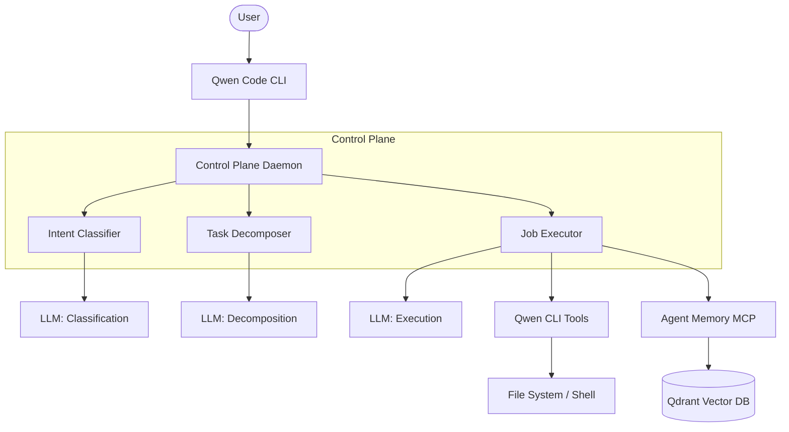

# Megalonyx Monorepo

This is a private monorepo with two jobs. First, it tracks changes from the upstream
[QwenLM/qwen-code](https://github.com/QwenLM/qwen-code) CLI project and selectively ingests
them through a quality gate pipeline. Second, it houses the Megalonyx agent stack — a set of
Python services that extend the CLI with persistent memory, task decomposition, and model routing.

The two halves live side by side. Upstream code arrives on the `integration` branch via the sync
pipeline. Megalonyx work lives on `develop`. Nothing in `apps/` or `packages/agent-*` is upstream
code — it was written here and has no relation to the qwen-code project.

---

## What's in it

| Component | Type | What it does | Location |
|---|---|---|---|
| Qwen Code CLI | Node.js application | Terminal AI agent: reads/writes files, runs shells, calls tools, talks to model providers | `packages/cli/`, `packages/core/` |
| control-plane-daemon | Python service | Receives tasks, classifies intent, decomposes into jobs, routes to models and tools | `apps/control-plane-daemon/` |
| agent-memory | Python service | Stores and retrieves memory via vector search; exposes an MCP server so agents can read/write memory | `packages/agent-memory/` |
| agent-infra | Python library | Shared logging and infrastructure utilities used by the two services above | `packages/agent-infra/` |
| Upstream sync pipeline | Python script | Fetches upstream qwen-code, runs quality gates, promotes to integration if gates pass | `tooling/sync-upstreams/` |



The three Python packages form a dependency chain: `agent-infra` ← `agent-memory` ← `control-plane-daemon`. They are members of a `uv` workspace rooted at the monorepo root.

---

## How the branches work

| Branch | What lands here | Who touches it |
|---|---|---|
| `upstream-mirror` | Reset to `upstream/main` on every sync. Never commit here. | Pipeline only |
| `integration` | Upstream changes that passed all quality gates. No Megalonyx work here. | Pipeline only |
| `develop` | All Megalonyx development. This is where active work happens. | Developers |
| `main` | Stable releases. | Merge from develop when ready |

The pipeline flow is: `QwenLM/qwen-code` → `upstream-mirror` → gate checks → `integration`.
Megalonyx work flows: `develop` → `main`.

To promote a verified state of `develop` to `integration` for a combined release, do a fast-forward merge.

---

## Getting started

**Prerequisites:** `node` 22+, `pnpm` 11+, `uv` (Python package manager), `curl`

### Node.js CLI (qwen)

```bash
# Install all Node.js dependencies
pnpm install

# Build the CLI and all its dependencies (core, acp-bridge, channels, web-templates)
pnpm build

# Verify the build
node dist/cli.js --version   # → 0.16.1
```

Run the CLI directly from the build output:
```bash
node dist/cli.js             # interactive session
node dist/cli.js "describe this repo"
```

Or install it globally from the repo:
```bash
npm install -g .
qwen                         # same binary, on PATH
```

Common development commands:

| Task | Command | Notes |
|---|---|---|
| Build CLI (+ deps) | `pnpm build` | Full compile + esbuild bundle |
| Compile packages only | `pnpm build:packages` | No bundle step |
| Build everything | `pnpm build:all` | Includes vscode extension |
| Run all tests | `pnpm test-all` | 376/377 pass (1 pre-existing upstream skip) |
| Lint | `pnpm run check` | ESLint via nx |
| Type-check | `pnpm run typecheck` | tsc --noEmit per package |
| Format | `pnpm run format` | Prettier via nx |
| Clean dist + node_modules | `pnpm run clean` | Safe to re-run pnpm install after |
| Full preflight | `pnpm run preflight` | install → build → lint → typecheck → test |

**Coming from QwenLM/qwen-code?** The pnpm equivalents are:

| npm (upstream) | pnpm (here) |
|---|---|
| `npm ci` | `pnpm install --frozen-lockfile` |
| `npm run build` | `pnpm build` |
| `npm test` | `pnpm test-all` |
| `npm run lint:ci` | `pnpm run check` |
| `npm run typecheck` | `pnpm run typecheck` |
| `npm run preflight` | `pnpm run preflight` |

**Why pnpm?** Strict package isolation — each package can only import what it explicitly declares.
This catches phantom dependencies that slip through npm's flat hoisting and would cause runtime
failures in environments without a matching global install. Installs are also significantly faster
via a content-addressed store shared across projects.

### Python services

```bash
# Install all Python packages (all three workspace members)
uv sync

# Verify the packages are importable
uv run python -c "import control_plane_daemon; import agent_memory; import agent_infra; print('ok')"

# Install the pre-commit hook (run once per clone)
bash tooling/install-hooks.sh
```

Set up runtime configuration (lives outside the repo — never committed):
```bash
# Qwen Code CLI settings: model providers, MCP server list (no secrets)
cp config/settings.example.json ~/.config/qwen/settings.json

# Megalonyx Python stack: API keys, Qdrant URL, runtime paths
cp config/megalonyx/.env.example ~/.config/megalonyx/.env
```

The installer (`scripts/megalonyx/install-megalonyx-stack.sh`) does both copies automatically and
adds `export QWEN_HOME="$HOME/.config/qwen"` to your shell profile so the CLI finds the config dir.
If you're setting up manually: `~/.config/qwen/settings.json` needs at least one model provider API key.
`~/.config/megalonyx/.env` only needs changes for non-default Qdrant URLs or Qdrant Cloud keys.

See `docs/megalonyx/installation.md` for the full setup walkthrough.

---

## Running the services

```bash
# Start the memory service (stays running, connects to Qdrant)
mega-memory

# Check what's running
mega-status

# Manage jobs
mega-tasks list
```

The Qwen Code CLI:
```bash
qwen                    # interactive session
qwen "describe this repo"
```

---

## Quality checks

All five of these run in CI on every push to `integration`, `develop`, and `main`.
Run them before committing.

```bash
uv run ruff check .                                                        # lint
uv run ruff format --check .                                               # formatting
uv run mypy tooling/ packages/sdk-python/src/                             # types
uv run python3 tooling/symmetry_check.py                                   # .qwen/config/ ↔ docs/ mirror
uv run python3 tooling/project_standards_linter.py --strict tooling/ docs/meta/  # naming + standards
```

The pre-commit hook (`tooling/git-hooks/pre-commit`) runs ruff and the standards linter automatically.
Install it once: `bash tooling/install-hooks.sh`

---

## Upstream sync

```bash
# Fetch upstream changes, run all gates, promote to integration if green
python3 tooling/sync-upstreams/upstream_ingest_pipeline.py

# Run gates against current state without fetching or promoting
python3 tooling/sync-upstreams/upstream_ingest_pipeline.py --dry-run
```

To contribute a fix back to the upstream qwen-code project:
```bash
tooling/sync-upstreams/contribute-upstream.sh <commit-hash> <new-branch-name>
```
This creates a clean branch from `upstream/main` (no monorepo history), cherry-picks your commit,
pushes to your public fork (`mirror` remote), and prints the PR URL.
See `docs/meta/git-strategy.md` for the full workflow.

---

## Where to find things

| File or directory | What it is |
|---|---|
| `apps/control-plane-daemon/` | Python service: task intake, decomposition, model routing |
| `packages/agent-memory/` | Python service: vector memory store and MCP server |
| `packages/agent-infra/` | Python library: logging and infrastructure shared by both services |
| `packages/cli/` | Qwen Code CLI (inherited, upstream) |
| `packages/core/` | Qwen Code core library: tool registry, MCP client, model providers (upstream) |
| `tooling/sync-upstreams/` | Upstream ingest pipeline and contribution tooling |
| `tooling/project_standards_linter.py` | Enforces naming standards and config/docs symmetry |
| `tooling/symmetry_check.py` | Checks `.qwen/config/` ↔ `docs/` 1:1 mirror |
| `tooling/git-hooks/pre-commit` | Pre-commit hook source — install via `tooling/install-hooks.sh` |
| `bin/` | Executable entry points: `mega-memory`, `mega-tasks`, `mega-status` |
| `config/settings.example.json` | Qwen Code runtime config template (API keys, models, MCP servers) |
| `config/megalonyx/.env.example` | Megalonyx environment variable template |
| `.qwen/agents/` | Execution profiles — YAML+Markdown files that configure model selection per task type |
| `.qwen/skills/` | Skill definitions — reusable instruction sets the CLI can invoke |
| `docs/meta/engineering-standards.md` | Naming and code quality requirements |
| `docs/meta/git-strategy.md` | Branch architecture, pipeline flow, upstream contribution guide |
| `docs/meta/pipeline-runbook.md` | What to do when a gate fails |
| `docs/gap-analysis.md` | What we inherited from qwen-code, what we added, where they overlap |
| `docs/index.md` | Index of all significant documentation |
| `todo.md` | Current work tracking |

---

## Documentation

- `docs/upstream/` — How the inherited Qwen Code systems work (from a maintainer's perspective)
- `docs/megalonyx/` — How the Megalonyx Python stack works
- `docs/meta/` — Engineering standards, git strategy, pipeline operations
- `docs/gap-analysis.md` — Which qwen-code systems we use, replace, or ignore
