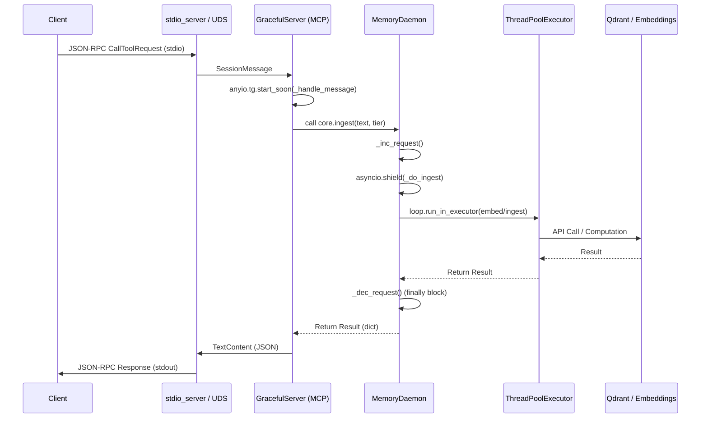

# Megalonyx Memory System Architecture

This document provides a detailed technical mapping of the Megalonyx Memory system, focusing on the interaction between the `MemoryDaemon` core and the MCP (Model Context Protocol) transport layer. This map is intended to support root cause analysis of race conditions during system shutdown.

## 1. MemoryDaemon Core

The `MemoryDaemon` serves as the central coordinator for semantic memory operations. It is designed to handle asynchronous requests while offloading heavy computational tasks to a thread pool to avoid blocking the `asyncio` event loop.

### Request Tracking Mechanism
To ensure graceful shutdowns, the `MemoryDaemon` tracks in-flight requests using a manual reference counter:

- **`_active_requests`**: An integer counter tracking the number of requests currently being processed.
- **`_request_lock`**: A `threading.Lock` used to ensure atomic increments and decrements of the counter.
- **`_inc_request()` / `_dec_request()`**: Internal methods used to wrap the lifecycle of every primary memory operation (`ingest`, `recall`, `reflect`).

### Execution Model & Offloading
The daemon utilizes a `ThreadPoolExecutor` (default `max_workers=4`) for CPU-bound or blocking I/O tasks:

1. **Heavy Work**: Operations such as generating embeddings (`embed`) or interacting with Qdrant (`ingest_func`) are wrapped in `loop.run_in_executor(self._executor, ...)`.
2. **Async Shielding**: Primary entry points use `asyncio.shield()`:
   ```python
   async def ingest(self, text: str, tier: str = "auto") -> dict[str, Any]:
       self._inc_request()
       return await asyncio.shield(self._do_ingest(text, tier))
   ```
   `asyncio.shield` prevents the internal `_do_...` task from being cancelled if the outer request task is cancelled (e.g., during a transport shutdown), ensuring that `_dec_request()` is always called in the `finally` block.

---

## 2. Transport Layer (`memory_transport.py`)

The transport layer implements the MCP server, allowing the `MemoryDaemon` to be controlled via `stdio` or Unix Domain Sockets (UDS).

### Server Implementations
- **`run_stdio_server`**: Uses `mcp.server.stdio.stdio_server()` to bind to `stdin`/`stdout`.
- **`run_socket_server`**: Uses `asyncio.start_unix_server` to bind to a UDS path, implementing `SO_PEERCRED` verification to restrict access to the owner's UID.

### The `GracefulServer` Implementation
The system uses a `GracefulServer` (subclass of `mcp.server.Server`) to modify the default shutdown behavior:

- **Task Group Management**: In the `run()` method, it creates an `anyio.create_task_group()`.
- **Non-Cancelling Shutdown**: Unlike the standard MCP server, `GracefulServer` deliberately **omits** `tg.cancel_scope.cancel()` in its `finally` block. This allows any tasks started via `tg.start_soon()` (the request handlers) to continue executing until completion even after the main message loop has terminated.

---

## 3. Request Lifecycle Map

The following sequence illustrates the path of a `CallToolRequest` (e.g., `ingest`) through the system:



---

## 4. Shutdown Sequence & Race Condition

### Shutdown Order of Operations (`stdio`)

When a client closes the `stdio` connection (EOF), the following sequence occurs:

1. **EOF Detection**: The `stdio_server()` read loop terminates.
2. **Server Exit**: `server.run()` returns.
3. **Handler Persistence**: `GracefulServer.run` exits its `finally` block without cancelling the `anyio` task group. In-flight `_handle_message` tasks continue.
4. **The Blocking Gate**: `run_stdio_server_async` enters a polling loop:
   ```python
   while core.active_requests > 0:
       await asyncio.sleep(0.1)
   ```
5. **Finalization**: Once `active_requests` hits 0, the function returns, and `asyncio.run()` terminates the process.

### The Race Condition Analysis

A race condition exists between the **Computation Completion** and the **Response Transmission**.

**The Gap:**
1. `MemoryDaemon._do_ingest` finishes its work and calls `_dec_request()`.
2. `core.active_requests` is now `0`.
3. The `run_stdio_server_async` loop sees `active_requests == 0` and immediately allows the process to exit.
4. **Simultaneously**, the `GracefulServer` handler is still in the process of taking the result from `core.ingest` and writing the JSON-RPC response to the `stdout` stream.

**Result:**
If the process exits (Step 3) before the `stdout` buffer is fully flushed to the client (Step 4), the client receives a truncated response or a "Connection closed" error, despite the memory operation having successfully completed on the backend.

**Critical Path of Failure:**
`_dec_request()` $\to$ `Blocking Gate Exit` $\to$ `Process Termination` $\implies$ `stdout.write()` (Interrupted).
