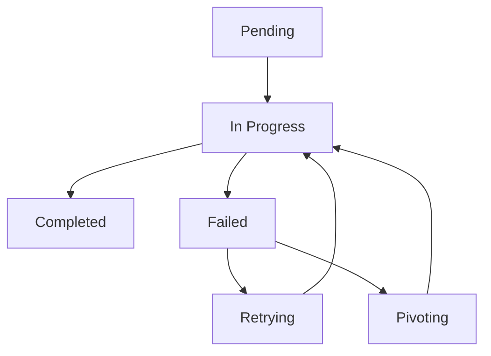

 
# JobStateManager Architectural Documentation

## 1. Identity & Role
The `JobStateManager` acts as the **State Authority** and **Scheduler** for the execution pipeline. It maintains the "Source of Truth" regarding the progress of a task, managing the lifecycle of individual jobs and resolving the dependency graph to determine the next executable action.

## 2. Core Logic & Algorithm

### State Persistence
The `JobStateManager` leverages a `StateManager` backend to ensure that the state of the active job set is persisted across execution cycles. This prevents loss of progress in the event of a system crash or agent restart.

### Dependency Resolution Algorithm
The core scheduling logic resides in `get_next_job()`:
1. **Filter**: Identify all jobs with `status == "pending"`.
2. **Dependency Check**: For each pending job, verify if all IDs listed in its `dependencies` list have a status of `completed`.
3. **Selection**: Return the first job that satisfies these conditions, ensuring a strictly ordered execution of the pipeline.

### Dynamic Job Injection
The manager supports the dynamic addition of jobs via `add_job()`. This is critical for the **S-CORRECT Loop**, where the `VerificationEngine` or an agent may identify a failure that requires a new "Correction Job" to be inserted into the pipeline before the original job can be retried.

## 3. Interface Specification

### Inputs
| Source | Method | Parameter | Type | Description |
| :--- | :--- | :--- | :--- | :--- |
| TaskDecomposer | `initialize_job_set` | `jobs` | `list` | The initial sequence of jobs. |
| VerificationEngine| `update_job_status`| `job_id`, `status`| `str`, `str` | Updates job state based on verification. |
| Orchestrator | `add_job` | `job` | `dict` | Injects a new job (e.g., correction) into the set. |

### Outputs
| Destination | Method | Return Value | Type | Description |
| :--- | :--- | :--- | :--- | :--- |
| Orchestrator | `get_next_job` | `job` | `dict` | The next executable job in the sequence. |
| Orchestrator | `is_task_complete`| `is_complete` | `bool` | True if all jobs in the set are `completed`. |

## 4. State Transitions
The `JobStateManager` tracks the following lifecycle for each job:

- **Pending**: Initial state; awaiting dependency resolution.
- **In Progress**: Currently being executed by an agent.
- **Completed**: Successfully verified by the `VerificationEngine`.
- **Failed**: Verification failed; triggers correction logic.

## 5. Critical Dependencies
- **`StateManager`**: The underlying persistence layer for storing the `active_job_set`.
- **`datetime`**: Used for auditing `start_time` and `updated_at` timestamps.
